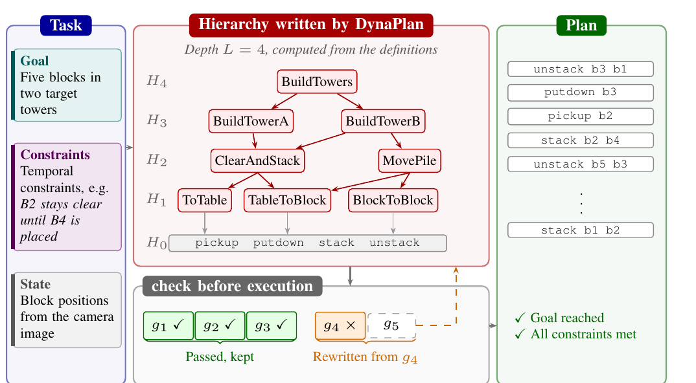
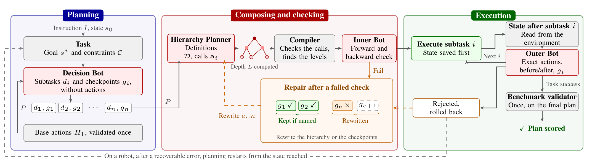
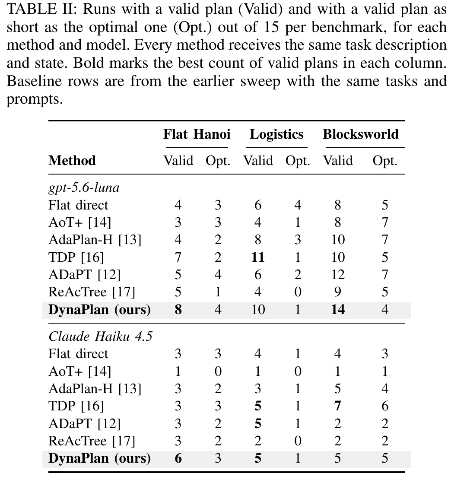
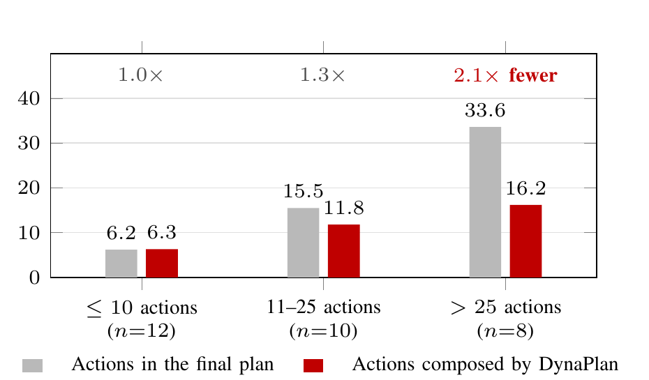
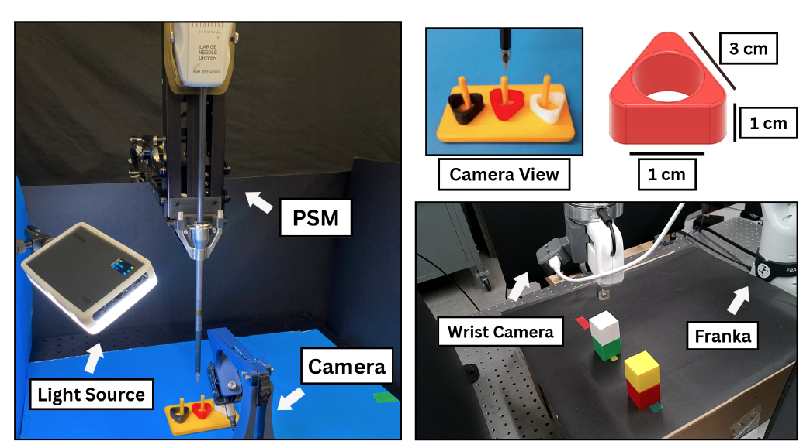

# DynaPlan

**Dynamic Hierarchy Discovery for Robotic Planning in Long-Horizon Puzzle Tasks**

This repository holds the DynaPlan framework, the benchmark harness used in the
paper, and the project page.

## Abstract

Language model planners for long-horizon robot tasks become less reliable as
plans grow, since every action must be correct and earlier mistakes make later
ones more likely. Hierarchical decomposition groups primitive steps into
higher-level actions, but existing methods fix the number of levels in advance,
and when composed actions may call only primitives the planner still writes out
every step. We introduce DynaPlan, a planning framework in which composed
actions may call other composed actions, so the number of levels is not fixed in
advance. A language model checks the fully expanded plan before execution, in a
forward pass over its actions and a backward pass over its goals and
constraints, and a failed plan is repaired by rewriting only the part at fault
from the first failing subtask. We evaluate DynaPlan on flat Tower of Hanoi and
on the Logistics and Blocksworld domains of the LexiCon benchmark, which adds
temporal constraints to classical planning problems. We further validate
DynaPlan on two real robots executing primitive skills, a dVRK solving flat
Tower of Hanoi and a Franka arm solving Blocksworld problems.



*A composed action may call other composed actions, so one definition can cover
many primitive steps. The level of an action follows from what it calls, and the
depth of the hierarchy is the largest level among the definitions. Action names
are illustrative.*

## How It Works



The Decision Bot splits the task into subtasks and checkpoints without naming
any actions. The Hierarchy Planner then writes the composed actions that reach
those checkpoints, and a compiler expands them into a single list of primitive
actions after checking that every callee exists, that arities match and that no
action calls itself. The Inner Bot reads the expanded list once before anything
runs, forward over the actions and backward over the goals and constraints, and
a rejected plan is repaired by rewriting only the artifact at fault. During
execution the Outer Bot reviews each subtask against its checkpoint without
seeing the Inner Bot verdict, so the two judgments stay independent. The
benchmark validator runs once, on the submitted plan.

## Results

Each method plans 15 tasks per benchmark with two models, under the same task
description, the same action and constraint definitions and the same
instruction to use as few actions as possible. No method sees the validator
during planning.



DynaPlan solves the most flat Tower of Hanoi tasks with both models, and it is
the only planner to solve a Hanoi instance whose optimal solution is 35 moves
long, where no baseline solves one longer than 11 moves.



A planner that writes its plan directly must produce every action the robot
executes. DynaPlan composes one call per subtask along with the definitions
those calls use, and the compiler expands them. On plans of ten actions or fewer
that saves nothing, and on plans longer than 25 actions the model composes 16.2
actions for a 33.6-action plan.

### Real Robots



Both robots execute fixed primitive skills with no learned policy, and the state
after each subtask is read by colour thresholding against a fixed palette. A
ring move on the dVRK expands to four primitives, and a block move on the Franka
expands to two.

## Repository Layout

| Path | What is in it |
|---|---|
| `dynaplan/baselines/dynaplan/` | The framework itself. The prompts for each domain, the JSON contracts the planner writes against, the compiler, the two verification passes, the repair loop and the execution controller, plus the entry point for a single benchmark condition. |
| `dynaplan/baselines/TDP/` | A note on how TDP was reimplemented, since it has no public code. |
| `dynaplan/benchmarks/` | The frozen task registry, the scripts that run the campaign, and the flat Tower of Hanoi generator and evaluator as an installable package. |
| `dynaplan/ARCHITECTURE.md` | Design reference for the pipeline, with the diagram beside it. |
| `assets/`, `index.html`, `style.css` | The project page and its figures. |

## Running the Benchmarks

1. Python 3.10 or newer. Install the harness requirements, then install the
   flat Tower of Hanoi package in editable mode:
   ```bash
   pip install -e dynaplan/benchmarks/Flat-Hanoi
   ```
2. Put provider keys in the environment, for example `OPENAI_API_KEY` and
   `ANTHROPIC_API_KEY`. Nothing is read from a checked-in file.
3. Run the offline check, which makes no paid calls:
   ```bash
   python dynaplan/benchmarks/dynaplan_v13_smoke.py
   ```
4. Run the campaign. Registration and verification happen offline, and
   inference starts only with `--execute`:
   ```bash
   python dynaplan/benchmarks/dynaplan_v13_sweep.py --execute
   ```
   Results are written to a local results directory that this repo ignores.

The 45 tasks are fixed in `official_sweep_v1.json`: three flat Tower of Hanoi
instances for each of N = 3 to 7, and three LexiCon problems at each of 1, 3, 5,
7 and 10 constraints in Logistics and in Blocksworld.

## Baselines and Benchmarks

Third-party code is not vendored here. Clone it next to
`dynaplan/baselines/` to reproduce the comparison.

| Method | Repository |
|---|---|
| AdaPlan-H | https://github.com/import-myself/AHP |
| ADaPT | https://github.com/archiki/ADaPT |
| AoT+ | https://github.com/llmsresearch/aot-plus |
| LLM+P | https://github.com/Cranial-XIX/llm-pddl |
| ReAcTree | https://github.com/Choi-JaeWoo/ReAcTree |
| LexiCon benchmark | https://github.com/Periklismant/lexicon_neurips |

TDP has no public implementation. It was reimplemented from the prompts and
algorithm in its paper, and `dynaplan/baselines/TDP/README.md` records what that
involved.

## Not Included

- Model outputs, run logs and scored results, which the scripts regenerate.
- The Unity simulator and the recorded videos from the earlier project.
- Third-party baseline checkouts and the LexiCon data, linked above.
