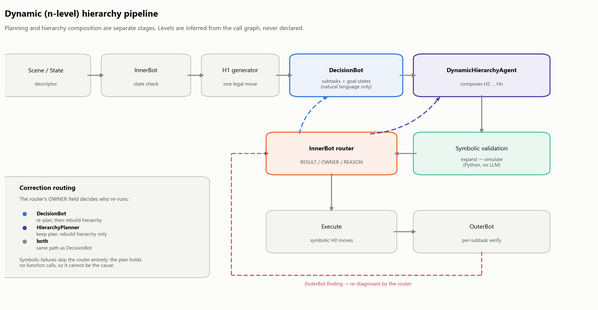
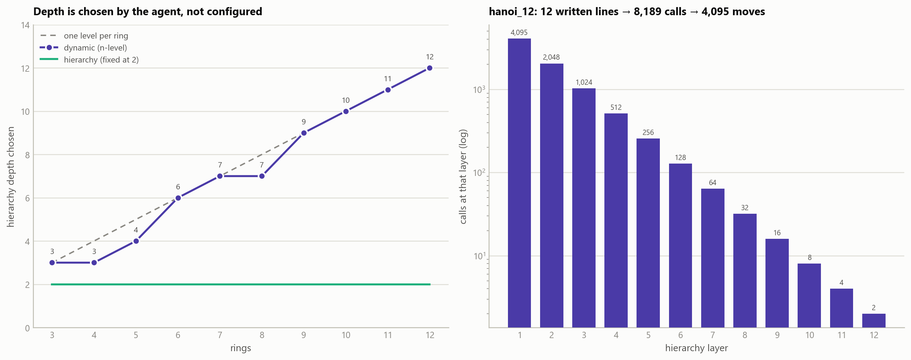
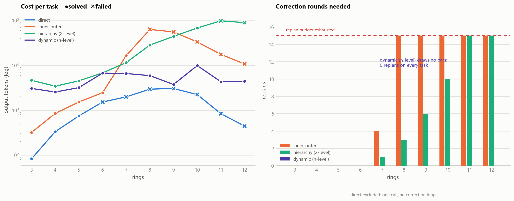

# Dynamic (n-level) Hierarchy — Implementation and Results

Implementation of the dynamic hierarchy planner proposed in
[`HIERARCHY_SCALER_DESIGN.md`](HIERARCHY_SCALER_DESIGN.md), plus a four-way
benchmark against the existing pipelines.

**Headline:** the n-level pipeline solves 10/10 Hanoi tasks optimally with zero
correction rounds, at 7.1x fewer output tokens than the two-level pipeline,
which solves 8/10.

---

## 1. What changed

The two-level pipeline forbids an H2 function from calling another H2. Every
composed action must therefore spell out its H1 calls literally, so the text of
the response has to contain all 2^n - 1 moves. At hanoi_12 that is 4,095 calls,
roughly 30k tokens, against an 8,192-token cap. It does not fit at any reasoning
level.

The n-level pipeline lets a level call the level below it:

```
MoveTower12(src, aux, dst) = [MoveTower11(src, dst, aux), MoveSingleRing(src, dst), MoveTower11(aux, src, dst)]
```

Twelve lines like that expand - in Python, not in the model's output - into
4,095 moves. Identical executed work, O(n) emission instead of O(2^n).

### Pipeline

| Stage | Two-level | n-level |
|---|---|---|
| StateDescriptor | yes | unchanged |
| InnerBot state check | yes | unchanged |
| H1 generator | yes | unchanged |
| DecisionBot | plans **and** emits the action sequence | **plan only** - subtasks + goal states, no calls |
| Hierarchy composition | H2 built before the plan exists, capped at 2 levels | **DynamicHierarchyAgent** builds H2..Hn *from* the plan |
| Symbolic validation | `validate_symbolic_plan` | level-generic equivalent |
| InnerBot plan check | binary YES/NO | **router**: `RESULT` / `OWNER` / `REASON` |
| OuterBot | verdict returns to the planner | verdict returns to the **router**, which re-diagnoses |

Two structural guarantees fall out of the split:

- The DecisionBot is shown no composed actions and is never given a call format,
  so it *cannot* emit a solution.
- The plan contains no function calls, so it cannot fail symbolic validation.
  Symbolic failures are therefore attributed to the hierarchy deterministically,
  with no model call spent on attribution.



---

## 2. How the number of layers is decided

Not pre-configured, and not built up across rounds. **One model call emits the
whole hierarchy, and the harness infers the depth afterwards.**

- Nothing in the harness, config, or prompt specifies a level count. There is no
  `--levels` flag. The prompt says there is no fixed number of levels and shows
  an abstract nesting example (`BaseAction` / `Level2Action` / `Level3Action`)
  with placeholder names that never mention towers.
- The model writes definitions; it never labels anything "H4".
- `dynamic_scoring.infer_levels` reads the call graph and assigns
  `level(primitive) = 0`, `level(f) = 1 + max(level of callees)`. Cycles and
  unresolvable callees are reported as errors. Depth is therefore *measured*,
  not declared.

### What it chose

| rings | 3 | 4 | 5 | 6 | 7 | 8 | 9 | 10 | 11 | 12 |
|---|---|---|---|---|---|---|---|---|---|---|
| depth | 3 | 3 | 4 | 6 | 7 | 7 | 9 | 10 | 11 | 12 |

Depth tracks task size roughly 1:1. In every task the model built **exactly one
function per layer** - a straight chain, no branching. It rediscovered the
recursive decomposition of Hanoi on its own.

Worth noting: it went pure depth, zero breadth. For Hanoi that is correct, since
there is only one useful abstraction to find. Whether it ever builds a *library*
at a level is untested and needs a domain where several distinct sub-skills
matter.



---

## 3. Benchmark

### Configuration

| | |
|---|---|
| Model | `gpt-5.5`, identical across all four arms |
| Reasoning effort | `low`, explicitly pinned and verified in every run record |
| Endpoint | OpenAI Chat Completions API |
| Max output tokens per call | 8,192 |
| Replan budget | 15 |
| Goal state | model-generated (`fixed_goal=False`) |
| Verifier | LLM for inner-outer / hierarchy / dynamic; none for direct |
| Tasks | hanoi_3 .. hanoi_12 (3-12 rings, 7-4,095 optimal moves) |
| Repetitions | **1 per cell** |
| Run dates | direct / inner-outer / hierarchy: 2026-07-06/07 · dynamic: 2026-08-07 |

Cell values below are **output tokens** (completion tokens, reasoning included,
prompt tokens excluded). `r=N` is replans. Every solve in every arm was optimal.

### Results

| task | direct | inner-outer | hierarchy (2-level) | dynamic (n-level) |
|---|---|---|---|---|
| hanoi_3 | OK 83 | OK 321 | OK 4,662 | **OK 3,073** |
| hanoi_4 | OK 335 | OK 851 | OK 3,440 | **OK 2,551** |
| hanoi_5 | OK 749 | OK 1,532 | OK 4,542 | **OK 3,205** |
| hanoi_6 | FAIL 1,529 | OK 2,466 | OK 6,817 | **OK 6,742** |
| hanoi_7 | FAIL 1,994 | OK 16,555 (r=4) | OK 11,554 (r=1) | **OK 6,608** |
| hanoi_8 | FAIL 2,961 | FAIL 63,407 (r=15) | OK 28,481 (r=3) | **OK 5,923** |
| hanoi_9 | FAIL 3,061 | FAIL 55,854 (r=15) | OK 44,380 (r=6) | **OK 3,765** |
| hanoi_10 | FAIL 2,241 | FAIL 33,359 (r=15) | OK 68,319 (r=10) | **OK 9,933** |
| hanoi_11 | FAIL 841 | FAIL 17,620 (r=15) | FAIL 98,688 (r=15) | **OK 4,331** |
| hanoi_12 | FAIL 445 | FAIL 10,779 (r=15) | FAIL 90,046 (r=15) | **OK 4,451** |
| **solved** | 3/10 | 5/10 | 8/10 | **10/10** |
| **output tokens** | 14,239 | 202,744 | 360,929 | **50,582** |
| **model calls** | 10 | 174 | 338 | **123** |
| **replans** | 0 | 79 | 55 | **0** |

The ceiling moves n=5 -> n=7 -> n=10 -> n=12+. The n-level arm is the only step
in that sequence that is not a capability-for-cost trade: it is cheaper than the
two-level pipeline on **every individual task**, not just in aggregate.



### Where the tokens go

Per-stage, dynamic arm, all 10 tasks combined:

| stage | calls | output tokens | share |
|---|---|---|---|
| DecisionBot (plan only) | 10 | 22,839 | 45.2% |
| DynamicHierarchyAgent | 10 | 10,679 | 21.1% |
| OuterBot | 63 | 9,052 | 17.9% |
| H1 generator | 10 | 3,213 | 6.4% |
| StateDescriptor | 10 | 2,744 | 5.4% |
| InnerBot router | 10 | 1,663 | 3.3% |
| InnerBot state check | 10 | 392 | 0.8% |

Composing twelve nested levels is cheap. Natural-language planning costs twice
as much as building the entire hierarchy.

---

## 4. Why it works

The three wins are not independent. They all follow from the model no longer
having to write out the answer.

**Fewer tokens** is mechanical: 12 structural lines instead of 4,095 enumerated
calls.

**Zero replans** follows from error compounding. Writing 1,023 moves correctly
requires 1,023 correct decisions in sequence. Writing 12 lines requires 12, and
each is the same pattern repeated. The two-level pipeline's replan curve is that
compounding made visible - it tracks sequence length, not conceptual difficulty:

| task | moves to transcribe | replans |
|---|---|---|
| hanoi_7 | 127 | 1 |
| hanoi_8 | 255 | 3 |
| hanoi_9 | 511 | 6 |
| hanoi_10 | 1,023 | 10 |
| hanoi_11 | 2,047 | 15 (fail) |
| hanoi_12 | 4,095 | 15 (fail) |

**Fewer calls** follows from that, multiplicatively. Each two-level replan
regenerates the entire pipeline - StateDescriptor, InnerBot state check, H1, H2,
Decision - so 16 rounds at hanoi_11 costs 80 calls plus verifiers. Zero replans
does not save 15 calls, it saves ~80.

**The evidence that this is notation and not capability:** at hanoi_11 and 12
the two-level pipeline spent 90-99k output tokens across 16 full attempts and
executed *zero moves*. It never got far enough to reason. Reasoning intensity
was comparable in both pipelines (325 vs 290 reasoning tokens per call), so the
n-level pipeline is not thinking harder - it is transcribing less.

---

## 5. Caveats

- **n=1 per cell.** Two independent dynamic runs (API-default effort and pinned
  `low`) differed up to 3.4x in per-task tokens - hanoi_11 was 14,749 vs 4,331 -
  driven by how many subtasks the planner emits, since each subtask costs one
  OuterBot call. Solve rate and aggregate cost are the robust signals; per-task
  token numbers are noisy. n>=3 repetitions are needed.
- **The three baseline columns are month-old runs.** Model or endpoint drift is
  uncontrolled. Reasoning effort is now matched; drift is not.
- **No `--max-tokens` control.** The obvious objection - "does the baseline
  survive at 32,768?" - is unanswered. The structural argument says the wall
  moves rather than disappears, but that is a prediction, not a result.
- **Hanoi flatters this technique.** It is perfectly recursive, so one rule
  generates the whole solution and compression is near-maximal. A domain with
  irregular structure would compress less.

---

## 6. Implementation

New files, all additive - `scoring.py` and `prompts.py` are untouched:

| File | Contents |
|---|---|
| `dynamic_scoring.py` | level inference, cycle detection, per-level histogram, router/plan parsers, back-compat bridge to the existing metrics schema |
| `dynamic_prompts.py` | plan-only DecisionBot, DynamicHierarchyAgent, InnerBot router |
| `dynamic_hierarchy_benchmark.py` | the loop, writing to mode `dynamic-hierarchy` |
| `test_unrolled_tower.py` | feasibility harness - hand-written hierarchies through the unmodified parser |
| `test_dynamic_scoring.py` | level inference + replay against committed baseline runs |
| `test_dynamic_prompts.py` | prompt contracts + format round trip |
| `test_dynamic_loop.py` | routing behaviour, driven by a scripted client |
| `figures/generate_dynamic_hierarchy_figures.py` | the three figures in this document |

Modified: four additive edits to `hanoi_benchmark.py` (metrics passthrough, mode
notes, steps payload, summary display), mock-client branches in `models.py`, and
a new `--mode dynamic-hierarchy` in `opensource_models/run_open_source.py`.

71 offline tests, no API calls, ~0.4s.

```bash
# run the new mode
python benchmarking/dynamic_hierarchy_benchmark.py --task all --provider openai --model gpt-5.5 --reasoning low

# regenerate the figures from results/
python benchmarking/figures/generate_dynamic_hierarchy_figures.py
```

---

## 7. Next steps

1. **Fresh baseline re-run** plus a `--max-tokens 32768` control arm, in one
   session, to close the remaining two confounds (~1M output tokens).
2. **n>=3 repetitions** per cell, given the observed variance.
3. **Domain seam** (`Domain` protocol + `HanoiDomain`, then Blocks World) if the
   goal is to benchmark puzzles beyond Hanoi. Currently `apply_hanoi_move`,
   `extract_moves_from_h0`, and the H1 contract are hardwired.
4. **Skills module** from the design document is not built. The
   `previous_hierarchies` hook exists in the prompt signature but the loop never
   passes it - with 0 replans there has been nothing to reuse.
5. **Open-source models.** The Qwen / Ministral vLLM setup is wired to the new
   mode but untested. Small models are where the output-format risk actually
   bites, so parse failures should be reported separately from planning failures.
