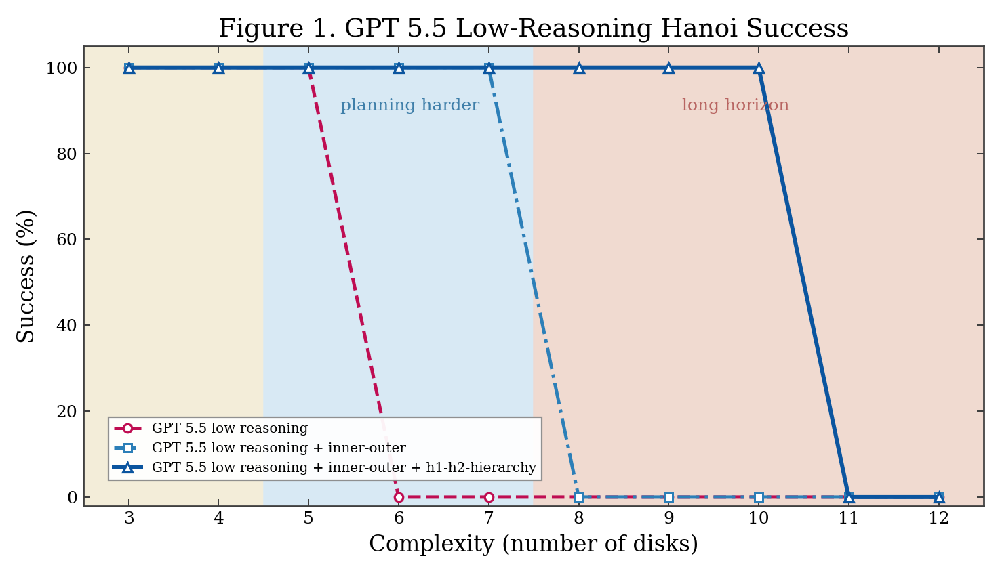

# Benchmark Figures

## Figure 1

Figure 1 compares three GPT 5.5 low-reasoning benchmark setups on Tower of Hanoi tasks from
`hanoi_3` through `hanoi_12`.

- Figure: [figure_1_gpt55_low_hanoi_3_to_12.png](figure_1_gpt55_low_hanoi_3_to_12.png)
- Caption: [figure_1_gpt55_low_hanoi_3_to_12_caption.md](figure_1_gpt55_low_hanoi_3_to_12_caption.md)
- Source data: [figure_1_gpt55_low_hanoi_3_to_12_data.json](figure_1_gpt55_low_hanoi_3_to_12_data.json)
- Previous 3-9 version: [figure_1_gpt55_low_hanoi_3_to_9.png](figure_1_gpt55_low_hanoi_3_to_9.png)

### Setup

All runs used:

- Provider: `openai`
- Model: `gpt-5.5`
- Reasoning: `low`
- Tasks: `hanoi_3`, `hanoi_4`, `hanoi_5`, `hanoi_6`, `hanoi_7`, `hanoi_8`, `hanoi_9`, `hanoi_10`, `hanoi_11`, `hanoi_12`
- Scoring: a run is counted as success if `solved=true` and `legal=true`

The plotted value is single-run success, not a 25-sample aggregate accuracy. A point is `100`
when that run solved the task legally, and `0` when it did not.

### Compared Conditions

| Label in figure | Benchmark mode | Command shape |
|---|---|---|
| `GPT 5.5 low reasoning` | Direct agent only, no framework | `python benchmarking\hanoi_benchmark.py --task hanoi_N --provider openai --model gpt-5.5 --reasoning low --no-framework` |
| `GPT 5.5 low reasoning + inner-outer` | Direct agent with LLM InnerBot/OuterBot verifier and replanning, no H1/H2 hierarchy | `python benchmarking\hanoi_benchmark.py --task hanoi_N --provider openai --model gpt-5.5 --reasoning low --no-framework --inner-outer` |
| `GPT 5.5 low reasoning + inner-outer + h1-h2-hierarchy` | Full hierarchy framework with StateDescriptor, H1, H2, DecisionBot, InnerBot, and OuterBot | `python benchmarking\hanoi_benchmark.py --task hanoi_N --provider openai --model gpt-5.5 --reasoning low` |

### Aggregate Counts

| Setup | Runs | Success count | Success rate | Total replans | Total model calls | Total tokens |
|---|---:|---:|---:|---:|---:|---:|
| GPT 5.5 low reasoning | 10 | 3 | 30.0% | 0 | 10 | 22,372 |
| GPT 5.5 low reasoning + inner-outer | 10 | 5 | 50.0% | 79 | 174 | 524,607 |
| GPT 5.5 low reasoning + inner-outer + h1-h2-hierarchy | 10 | 8 | 80.0% | 50 | 338 | 1,190,917 |

Full hierarchy call counts across all ten runs:

| Count type | Total |
|---|---:|
| H0 calls | 8128 |
| H1 calls | 2032 |
| H2 calls | 80 |

### Per-Task Results

| Task | Direct success | Direct moves | Inner-outer success | Inner-outer replans | Full hierarchy success | Full hierarchy replans | Full hierarchy moves |
|---|---:|---:|---:|---:|---:|---:|---:|
| `hanoi_3` | 100 | 7/7 | 100 | 0 | 100 | 0 | 7/7 |
| `hanoi_4` | 100 | 15/15 | 100 | 0 | 100 | 0 | 15/15 |
| `hanoi_5` | 100 | 31/31 | 100 | 0 | 100 | 0 | 31/31 |
| `hanoi_6` | 0 | 63/63 | 100 | 0 | 100 | 0 | 63/63 |
| `hanoi_7` | 0 | 127/127 | 100 | 4 | 100 | 1 | 127/127 |
| `hanoi_8` | 0 | 243/255 | 0 | 15 | 100 | 3 | 255/255 |
| `hanoi_9` | 0 | 253/511 | 0 | 15 | 100 | 6 | 511/511 |
| `hanoi_10` | 0 | 171/1023 | 0 | 15 | 100 | 10 | 1023/1023 |
| `hanoi_11` | 0 | 31/2047 | 0 | 15 | 0 | 15 | 0/2047 |
| `hanoi_12` | 0 | 0/4095 | 0 | 15 | 0 | 15 | 0/4095 |

### New 10-12 Run Summary

| Task | Direct result | Inner-outer result | Full hierarchy result |
|---|---|---|---|
| `hanoi_10` | Failed: illegal move at move 80 after 171 moves | Failed: max replans exhausted before execution | Solved optimally: 1023/1023 moves, 10 replans |
| `hanoi_11` | Failed: legal but incomplete 31/2047 moves | Failed: max replans exhausted before execution | Failed: max replans exhausted before execution |
| `hanoi_12` | Failed: no valid parsed plan, 0/4095 moves | Failed: max replans exhausted before execution | Failed: max replans exhausted before execution |

### Result Files

Each point links back to a `metrics.json` file in:

- `benchmarking/results/gpt-5.5/not-hierarchy/`
- `benchmarking/results/gpt-5.5/inner-outer/`
- `benchmarking/results/gpt-5.5/hierarchy/`

The exact metrics paths used to build the figure are stored in
[figure_1_gpt55_low_hanoi_3_to_12_data.json](figure_1_gpt55_low_hanoi_3_to_12_data.json).
