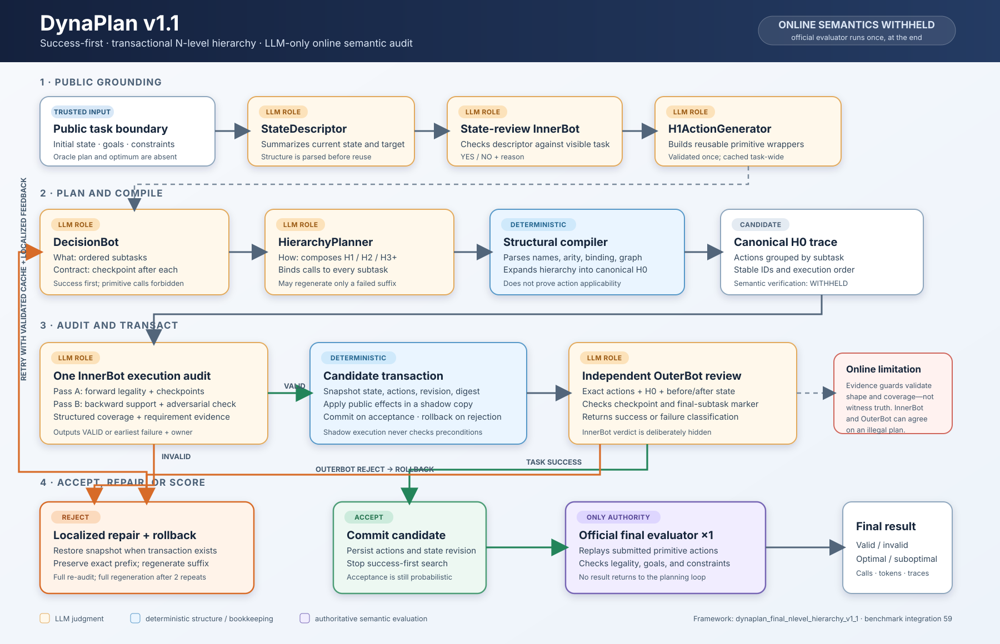

# DynaPlan architecture and design

This document is the implementation-grounded architecture reference for
`dynaplan_final_nlevel_hierarchy_v1_1` (benchmark integration version `59`).
DynaPlan is a success-first, transactional N-level planning framework. It
separates task decomposition from hierarchical action composition, exposes the
fully expanded action trace to two LLM review stages, and withholds the official
deterministic evaluator until the final candidate.

The essential boundary is:

> DynaPlan is deterministic about artifact structure, trace construction,
> caching, and rollback. Its online semantic judgment is LLM-only. The official
> evaluator is the only authoritative judge of action legality, goals, and
> temporal constraints, and it runs once after planning.

This distinction is central to interpreting both the method and its results.

## Main architecture figure



The standalone, publication-ready source is
[`DYNAPLAN_ARCHITECTURE.svg`](./DYNAPLAN_ARCHITECTURE.svg). Orange boxes are
LLM roles, blue boxes are deterministic structure or bookkeeping, and purple
marks the only authoritative semantic evaluation.

## 1. Architectural objective

DynaPlan targets symbolic planning tasks in which a model must produce a legal
primitive action sequence while satisfying final goals and, when present,
temporal constraints. A single flat generation is brittle on long tasks: one
wrong precondition, lost object identity, malformed action, or missed temporal
obligation invalidates the whole answer. DynaPlan therefore decomposes the work
into explicit artifacts with narrow contracts:

1. represent the visible current state;
2. define reusable primitive capabilities;
3. decide *what* milestones must be achieved;
4. compose *how* to achieve them through an N-level hierarchy;
5. expand that hierarchy into one canonical primitive trace;
6. audit the trace before tentative execution;
7. review each executed subtask independently;
8. repair the earliest implicated suffix when possible; and
9. submit one final plan to the official evaluator.

The primary objective is task success. Primitive-action economy is secondary.
DecisionBot is explicitly instructed to find a plausible legal sequence first
and prefer fewer expanded primitive actions only among correctness-preserving
choices. Once OuterBot returns `TASK SUCCESS`, the controller commits and stops;
it does not continue sampling candidates merely to optimize length.

## 2. Design principles

### 2.1 Separate “what” from “how”

DecisionBot owns semantic decomposition and checkpoints, but it is not allowed
to emit executable calls. HierarchyPlanner owns mappings and calls, but it must
implement the DecisionBot contract. This division makes failure ownership
explicit: a bad milestone belongs to DecisionBot, a bad realization belongs to
HierarchyPlanner, and coupled errors belong to both.

### 2.2 Inspect the real execution boundary

Auditing only a high-level description hides errors introduced during
composition. DynaPlan deterministically expands the hierarchy into canonical H0
calls and gives that exact ordered trace to InnerBot and OuterBot. Structural
expansion resolves names, arities, parameter bindings, and call-graph shape. It
does **not** establish semantic legality.

### 2.3 Keep online verification LLM-only

The architecture is an explicit verifier ablation. During planning, neither a
PDDL simulator, the native Hanoi simulator, a typed state-machine verifier, nor
another exact semantic interpreter may reject a candidate. The prompts carry a
`semantic_verification: WITHHELD` marker, and the official evaluator's result is
never fed back into planning.

### 2.4 Isolate speculative execution

A candidate that passes InnerBot is executed against a transaction snapshot.
If OuterBot rejects any subtask, the controller restores all final-score-
relevant state. Rejected actions cannot leak into the next candidate.

### 2.5 Repair locally without pretending a prefix is proven

When deterministic parsing or an LLM audit localizes the earliest bad subtask,
DynaPlan preserves earlier numbered blocks byte-for-byte and regenerates the
suffix. A prefix localized by InnerBot is labelled
`audit-cleared-but-unverified`, never “verified.” Every merged candidate is
compiled and audited again in full from the frozen candidate-start state.

### 2.6 Preserve comparability and auditability

All model-visible public action and temporal semantics come from the shared
comparison contract. Oracle plans, optimal lengths, filesystem paths, and
private provenance helpers are structurally absent from the planning task.
Every prompt, response, model call, usage record, validation result, state
revision, repair certificate, and final score is persisted.

## 3. Trust and authority model

The pipeline has four different kinds of evidence. They must not be conflated.

| Evidence source | What it establishes | What it does **not** establish |
|---|---|---|
| Deterministic artifact validators | Required blocks exist; IDs, fields, and syntax satisfy their contracts | That the proposed checkpoints or actions are semantically correct |
| Deterministic hierarchy compiler | Function names, arities, bindings, level dependencies, and structural H0 expansion are valid | Preconditions, state transitions, checkpoints, goals, or temporal constraints |
| Non-rejecting shadow reducer | A stable public-effect trace and before/after presentation state for review | Applicability, type validity, monitor state, goal completion, or checkpoint truth |
| InnerBot and OuterBot | Model judgments about legality, support, checkpoints, and completion | A correctness guarantee; both can make correlated false-positive errors |
| Official final evaluator | Actual primitive-plan legality, final goals, and benchmark constraints | Online repair guidance; its result arrives only after planning ends |

The Python evidence guards are intentionally modest. They can prove that an
InnerBot response covered every manifest ID, used in-range indices, and was
arithmetically self-consistent. They cannot prove that a claimed state witness
is true.

## 4. End-to-end dataflow

### Step 0 — Construct an oracle-free public task

The official integration loads the private benchmark object only at the runner
boundary, then creates a slot-only public planning view. The planner receives:

- the visible initial state;
- public object and action descriptions;
- final goals;
- temporal constraints, if any; and
- the common action representation and minimum-action objective.

The public planning object has no fields for oracle actions, optimal length,
task directory, source files, or private source metadata. The private task is
reattached only inside final scoring.

### Step 1 — Render the current scene

The adapter deterministically renders the current public state into a
domain-appropriate scene. Scene data is state-scoped and tied to a monotonic
`state_revision`.

### Step 2 — Generate and validate StateDescriptor

StateDescriptor receives the visible task, rendered state, any prior rejected
descriptor, and stage-local feedback. It returns the framework's state and goal
description. A deterministic parser checks the required representation before
the artifact can be cached.

With the official configuration, `fixed_goal=False`, so this is a model call.
Malformed descriptors are rejected before consuming the later state-review
call.

### Step 3 — State-review InnerBot

The state-review call compares the descriptor with the visible task and current
scene. It returns a binary judgment and a reason. A rejection invalidates the
appropriate state-scoped artifacts and sends feedback to the next attempt.

This is distinct from the later execution-boundary audit: the former checks the
problem representation, while the latter checks a complete candidate trace.

### Step 4 — Generate and cache the H1 capability library

H1ActionGenerator defines the required H1 wrappers around the domain's H0
primitives. The standalone H1 validator checks the required mapping set and
structural relationship to the primitive operators. Once accepted, H1 is
task-scoped rather than state-scoped and is reused across replans.

This cache is important because most repairs change task-specific decisions or
hierarchy composition, not the domain's primitive capability definitions.

### Step 5 — DecisionBot produces subtasks and checkpoints

DecisionBot receives the public problem, current descriptor, H1 library, prior
feedback, and—during an eligible repair—a localized certificate. It returns
ordered pairs of blocks:

```text
start_subtask_1
<natural-language milestone; no executable function call>
end_subtask_1

start_subtask_goalstate_1
<complete checkpoint required after subtask 1>
end_subtask_goalstate_1
```

The same pattern repeats with contiguous one-based IDs. Its output contract
requires every description to have a matching goal-state block. The final
checkpoint must be compatible with all final goals and outstanding temporal
obligations.

DecisionBot's success-first self-review distinguishes:

- final-state facts, which must hold at the end;
- historical witnesses, which may cease to hold after being witnessed; and
- continuing or trigger-response obligations, which remain active according to
  their public temporal semantics.

Natural-language action verbs are permitted in descriptions. Actual call forms
such as `operator(...)` or `(operator ...)` remain forbidden so that DecisionBot
does not take over HierarchyPlanner's role.

#### Conservative checkpoint-tag normalization

The v1.1 normalizer repairs exactly one observed unambiguous syntax slip:

```text
start_subtask_goalstate_3
...
end_subtask_3
```

becomes:

```text
start_subtask_goalstate_3
...
end_subtask_goalstate_3
```

An ID qualifies only when its complete marker sequence uniquely proves that the
second short closer belongs to the goal-state block. Duplicate, missing,
reordered, inline, or fence-mismatched markers are untouched. No body text,
numbering, semantics, or downstream validation is changed. Raw and normalized
SHA-256 digests are recorded.

### Step 6 — HierarchyPlanner composes the implementation

HierarchyPlanner receives the accepted H1 library, normalized DecisionBot
contract, current state description, public/internal action rules, and
stage-local feedback. It may define H2, H3, or deeper mappings from lower-level
mappings and bind top-level calls to each DecisionBot subtask.

The levels have the following meaning:

- **H0:** primitive execution-boundary actions;
- **H1:** validated wrappers immediately above primitives;
- **H2/H3/...:** dynamically composed reusable mappings; and
- **top-level subtask calls:** the calls selected to implement one DecisionBot
  milestone.

The depth is inferred from the call graph rather than fixed to one hard-coded
number. Custom mappings must build on H1 or a lower-level custom mapping, not
bypass the hierarchy with raw H0 calls.

### Step 7 — Deterministically compile to a canonical H0 trace

The structural compiler parses H1 and custom mappings, checks names and arities,
resolves arguments through the call graph, prevents structurally invalid
composition, and expands every top-level call to H0. Its normalized output is a
`CompiledHierarchy` containing one `PlannedSubtask` per DecisionBot subtask:

```text
CompiledHierarchy
└── PlannedSubtask[index]
    ├── description
    ├── top_level_calls
    ├── h0_calls
    ├── semantic actions
    └── level_counts
```

In this LLM-only variant, the subsequent “projection” uses a non-rejecting
public-effect shadow. It therefore remains structurally useful but semantically
non-authoritative. The projection's checkpoint hook deliberately returns
`semantic_verification: WITHHELD` rather than checking the checkpoint.

### Step 8 — One InnerBot performs a dual-pass audit

The execution-audit InnerBot receives:

- public task and action rules;
- the visible candidate-start StateDescriptor;
- all DecisionBot checkpoints;
- the original composed hierarchy, marked untrusted and used for ownership;
- canonical H0 actions grouped by subtask;
- every final goal and temporal requirement with stable IDs;
- expected action/checkpoint/requirement counts;
- any prior repair feedback, marked untrusted; and
- an explicit record that semantic and official-evaluator feedback are
  withheld.

It performs two checks within one model call.

**Pass A — forward simulation**

The model initializes a compact ledger from state 0, checks every H0 action in
global order, applies effects only after its own applicability check, updates
temporal obligations, and tests the complete checkpoint at each subtask
boundary. It must return the earliest error rather than continuing past a known
failure.

**Pass B — backward support and adversarial review**

After a complete forward pass, the model starts from each final requirement and
traces support backward to the initial state or an establishing action. It must
check that later actions do not clobber the support and actively search for a
counterexample to the apparent forward conclusion.

The response is strict JSON. In simplified form:

```json
{
  "verdict": "INVALID",
  "first_bad_subtask": 2,
  "first_bad_action_in_subtask": 4,
  "owner": "HierarchyPlanner",
  "coverage": {
    "expected_actions": 37,
    "checked_actions": 11,
    "expected_checkpoints": 5,
    "checked_checkpoints": 1,
    "expected_final_requirements": 4,
    "checked_final_requirements": 0,
    "forward_check_complete": false,
    "backward_check_complete": false
  },
  "final_state_facts": [],
  "outstanding_requirements": ["goal_1"],
  "reason": "The package is not inside the truck being unloaded.",
  "requirement_evidence": []
}
```

For `VALID`, both failure indices must be zero, owner must be `NA`, all expected
and checked counts must match, both passes must be complete, the outstanding
list must be empty, and exactly one evidence row must cover every final
requirement.

Requirement evidence uses global state indices: state 0 is the candidate start,
state `i` is immediately after canonical action `i`, and state `N` is terminal.
The schema records the obligation type, evaluation horizon, witness states,
vacuity, and—specifically for `sometime_after`—the latest trigger and latest
response. A deterministic guard checks IDs, coverage, index bounds, and
self-consistency. It does not replay predicates or validate witness truth.

### Step 9 — Capture a candidate transaction

Only a candidate accepted by InnerBot proceeds to tentative execution. Before
executing it, the controller snapshots:

- the domain state copy;
- `state_revision`;
- executed primitive actions;
- high-level call list;
- expanded H0 list;
- total call counts and per-level counts;
- maximum hierarchy level; and
- the last illegal-action reason.

The transaction record also tracks starting action count and revision. The
snapshot covers every value that can affect final scoring.

### Step 10 — Apply actions to the non-rejecting shadow

The shadow reducer applies the public effects of each recognized primitive and
updates a stable state digest. It intentionally does not enforce preconditions,
types, checkpoint predicates, goals, or temporal-monitor state. It always
returns an applicable transition for structurally recognized actions.

The shadow exists to provide exact action history and consistent before/after
views to OuterBot. It is not a substitute for semantic verification.

### Step 11 — OuterBot reviews each exact subtask trace

After each tentative subtask, OuterBot receives:

- the public problem and rules;
- that subtask's DecisionBot objective and checkpoint;
- the authoritative record of attempted semantic actions, in order;
- the compiler-expanded H0 calls, in order;
- public shadow state before and after;
- the domain's state convention;
- an explicit `is_final_subtask` marker; and
- a `semantic_verification: WITHHELD` marker.

OuterBot does **not** receive InnerBot's verdict or certificate. This reduces
verdict anchoring and makes it a second judgment, although both roles may still
use the same underlying model and make correlated mistakes.

Its normalized statuses are:

| Status | Controller meaning |
|---|---|
| `TASK SUCCESS` | Accept the complete candidate and commit the transaction |
| `SUBTASK SUCCESS` | Current checkpoint appears satisfied; continue |
| `EXECUTE REMAINING ACTIONS` | Current trace appears sound; continue |
| `RECOVERABLE` | Reject the candidate, ask InnerBot to attribute ownership, roll back, and repair |
| `NON-RECOVERABLE` | Reject the candidate; after a clean rollback, reclassify it as a candidate-level failure and continue while attempts remain |

The final-subtask marker prevents a correct terminal review from being
misreported as only `SUBTASK SUCCESS`, which would otherwise waste the candidate
and force another attempt.

### Step 12 — Commit or roll back

If OuterBot returns `TASK SUCCESS`, the transaction commits the action list and
state revision. If a subtask is rejected, the controller first captures the
attempted output for diagnostics and then restores the exact snapshot.

Rollback restores:

- shadow state and digest;
- action, high-level, and H0 lists;
- revision number;
- level and call totals; and
- prior error state.

The rejected trace remains in telemetry but cannot become a cached valid
artifact. A rolled-back `NON-RECOVERABLE` verdict is not allowed to terminate
the entire offline search merely because one candidate failed.

### Step 13 — Localize and repair

There are two localization sources.

1. **Deterministic Decision validation.** If every error names a concrete
   subtask and all numbered block pairs are complete, the earliest failing ID
   defines a Decision suffix transaction.
2. **LLM execution audit.** A well-formed, coverage-complete `INVALID` response
   may provide the earliest failing subtask/action and owner. Its certificate
   is explicitly marked `certificate_source: llm_execution_audit` and
   `semantic_verification: WITHHELD`.

If the owner is HierarchyPlanner, DynaPlan preserves earlier compiled subtask
blocks and asks for only the hierarchy suffix. If the owner is DecisionBot or
`both`, it preserves earlier description/checkpoint pairs and asks for only the
Decision suffix; dependent hierarchy artifacts are invalidated.

A merge is accepted only when:

- preserved and repaired IDs are complete, contiguous, and disjoint;
- the patch contains exactly the requested numbered blocks;
- no extra prose or calls appear outside those blocks;
- preserved blocks remain exactly unchanged; and
- the merged artifact passes all normal parsing and compilation checks.

The complete merged candidate then returns through the full InnerBot audit from
the frozen start state. After two repeats of the same localized failure
signature, DynaPlan discards the local repair context and falls back to full
regeneration to avoid a repair loop.

### Step 14 — Invoke the official final evaluator once

After planning stops, the adapter gives the accumulated primitive sequence to
the benchmark's official deterministic scorer exactly once. LexiCon domains use
the released plan verifier; Flat Hanoi uses the native Hanoi evaluator. That
call determines validity and optimality. Its result is terminal and cannot
trigger repair.

The unified benchmark harness may independently rescore the persisted output to
check integration agreement. That harness-level audit is not an online
DynaPlan call and does not influence generation.

## 5. Logical bot contracts

“Bot” denotes a prompt role, not necessarily a separate model deployment. In an
official condition, these roles use the configured model client. OuterBot is
judgment-independent in the sense that it cannot see InnerBot's verdict; it is
not guaranteed to use different weights, sampling, or hidden context.

| Role | Primary inputs | Required output | Deterministic gate | Repair ownership |
|---|---|---|---|---|
| StateDescriptor | Public task, current scene, prior descriptor, feedback | Domain state/goal description | Descriptor parser and required-field validation | StateDescriptor |
| State-review InnerBot | Public task, scene, accepted descriptor | `YES/NO` and reason | Response parser only | State bundle or descriptor |
| H1ActionGenerator | Public rules, current context, feedback | Required H1 primitive-wrapper mappings | Exact mapping set, names, arities, and structural validation | H1 |
| DecisionBot | Descriptor, H1, public rules, feedback/certificate | Ordered description/checkpoint block pairs | Contiguous IDs, matched blocks, checkpoint structure, action-call prohibition | DecisionBot |
| HierarchyPlanner | H1, Decision plan, task/rules, feedback/certificate | H2/H3+ mappings and per-subtask calls | Mapping grammar, names, arities, bindings, level graph, H0 expansion | HierarchyPlanner |
| Execution-audit InnerBot | Candidate-start state, checkpoints, hierarchy, canonical H0, requirements, manifests | Strict audit JSON with verdict, coordinates, owner, coverage, ledgers, evidence | Schema, count, coverage, ID, and index guards | DecisionBot, HierarchyPlanner, or both |
| OuterBot | Exact attempted subtask trace, H0 calls, before/after shadow state, checkpoint, final marker | Normalized success/failure status and reason | Status parser | Rechecked by InnerBot for owner before repair |

## 6. Controller state machine

The configured budget is one initial pass plus up to 15 replan rounds.
Conceptually, the controller is:

```text
for attempt in 0..15:
    ensure valid StateDescriptor and state review
    ensure valid reusable H1
    ensure valid Decision artifact
    ensure structurally compiled hierarchy and canonical H0 trace

    audit = InnerBot(full candidate)
    if audit is INVALID:
        schedule localized repair when safe, otherwise invalidate owner scope
        continue

    transaction = snapshot(all final-score-relevant state)
    tentatively apply each subtask to the non-rejecting shadow
    outer = OuterBot(exact subtask trace, before/after state, final marker)

    if outer is TASK SUCCESS:
        commit(transaction)
        break
    if outer rejects:
        attribution = InnerBot(candidate + execution feedback)
        rollback(transaction)
        schedule localized repair when safe
        continue

official_score = evaluator(primitive_actions)  # exactly once
```

Stage exceptions caused by truncated model output are treated as concise-retry
events. Invalidation is dependency-aware: a hierarchy failure need not discard
DecisionBot or H1; a Decision failure discards dependent hierarchy; a state
change invalidates every state-scoped downstream artifact.

## 7. Cache and invalidation model

Only accepted artifacts enter the cache.

| Artifact | Scope | Reused when | Invalidated by |
|---|---|---|---|
| Rendered scene | State revision | Revision is unchanged | Committed state change |
| StateDescriptor | State revision | Parser accepted it at this revision | Descriptor rejection or state change |
| State-review result | State revision | InnerBot accepted descriptor at this revision | State/descriptor invalidation |
| H1 library | Task rollout | Standalone H1 validation passed | H1-specific evidence of failure |
| Decision plan | State revision | Decision validation passed | Decision/combined ownership or upstream invalidation |
| Hierarchy + H0 expansion | State revision | Compiler accepted it | Hierarchy ownership, Decision change, or upstream invalidation |

`state_revision` advances for every tentatively committed primitive action. A
rollback restores it along with the state, so a public-state self-loop cannot
silently preserve stale temporal history.

## 8. Domain adaptation

The orchestration, transaction, schemas, and repair mechanics are shared. Each
domain adapter supplies state rendering, action formatting, hierarchy grammar,
public rules, shadow-effect mapping, checkpoint representation, and final
scorer bridge.

| Domain | Public state convention | Public primitives | Special handling |
|---|---|---|---|
| Logistics | Object/vehicle locations and containment: `at`, `in` | load/unload truck or airplane, drive, fly | Tracks packages, vehicle contents, city/airport movement, final goals, and LexiCon temporal constraints |
| Blocksworld | `on`, `ontable`, `clear`, `holding`, `handempty` | pickup, putdown, stack, unstack | Exact block identity and hand state; LexiCon temporal constraints may accompany goals |
| Flat Hanoi | Peg arrays are bottom-to-top; final item is movable top ring | Public `MoveHoop(source, target)` | Internal H0 expands to `MoveArm`, `Grab`, `MoveArm`, `Drop`; held-ring identity and arm position must be tracked |

This makes DynaPlan reusable across new instances of these domains, but not
zero-shot across arbitrary unseen domains. A new domain still needs an adapter
that translates its public semantics into the shared contracts. There are no
hard-coded task IDs, oracle plans, or target action sequences.

## 9. Why the major decisions exist

| Decision | Motivation | Tradeoff |
|---|---|---|
| DecisionBot checkpoints | Make long-horizon intent explicit and localize where a plan diverges | Bad or over-constrained checkpoints can make a solvable task unreachable |
| Dynamic H2/H3+ composition | Reuse abstractions and reduce reasoning over long primitive sequences | Adds grammar and binding failure modes before execution |
| Canonical H0 expansion | Give critics the actual ordered execution boundary | Long traces increase audit context and bookkeeping difficulty |
| One dual-pass InnerBot | Add adversarial backward checking without a second critic call | Forward and backward conclusions are still produced by one correlated model context |
| Compact structured evidence | Prevent unsupported `VALID` answers caused by skipped requirements or fabricated coverage counts | Guards evidence shape, not semantic truth |
| Exact-trace OuterBot handoff | Stop OuterBot from inferring an unlisted path from endpoint states | Adds prompt length and still depends on LLM simulation accuracy |
| Hide InnerBot verdict from OuterBot | Reduce anchoring and preserve a second line of judgment | Same-model errors can remain correlated |
| Candidate transactions | Prevent rejected shadow actions from contaminating later attempts | Cannot help when both critics falsely accept the candidate |
| Continue after rollback | Treat a safely discarded candidate as a local failure, even if labelled non-recoverable | May spend more calls on difficult tasks |
| Localized suffix repair | Preserve usable work and focus context on the earliest failure | An LLM-localized prefix is not proof and must be fully re-audited |
| Two-repeat fallback | Avoid endless local patch loops | Full regeneration discards potentially useful partial work |
| Conservative tag normalization | Recover outputs whose only error is an unambiguous closer typo | Intentionally leaves ambiguous formatting failures unrepaired |
| Exact-once final evaluator | Prevent hidden simulator feedback from turning the method into search over an exact verifier | False acceptance is discovered too late to repair |
| Success-first stopping | Prioritize valid task completion over length optimization | Valid plans may be suboptimal |

## 10. Safety, fairness, and information boundaries

### Public-task isolation

The integration checks that private and public task types differ and that
forbidden oracle fields are structurally absent. Planning uses the public task;
the private task is available only at the final scoring boundary.

### Shared prompt semantics

The frozen comparison protocol is `shared-public-semantics-v3`. DynaPlan, Base,
and literature ports receive the same public domain action semantics, LexiCon
temporal definitions, and minimum-action objective exactly once per model call.
Flat-Hanoi calls also receive the same target-disjoint solved three-ring example
and public `MoveHoop` representation.

DynaPlan retains method-specific hierarchy, checkpoint, audit, and repair
instructions. Those are the method under evaluation, not private task hints.

### No online semantic oracle

Planning prompts explicitly state that semantic verification is withheld. The
shadow does not contain PDDL monitor state and cannot reject an action. The
official evaluator call counter raises if DynaPlan attempts to invoke it more
than once.

### Compute is not matched

DynaPlan can use substantially more calls and tokens than one-call baselines.
Any result table should therefore report at least validity, optimality, calls,
tokens, and cost. Validity alone is an incomplete comparison.

## 11. Failure paths and known limitations

### 11.1 Semantic false acceptance is the principal architectural risk

The unsound branch is:

```text
illegal candidate
  → InnerBot says VALID
  → shadow execution cannot reject it
  → OuterBot says TASK SUCCESS
  → transaction commits
  → official evaluator rejects the plan
```

Transactions solve rejected-plan leakage, not wrong acceptance. Evidence guards
prevent incomplete certificates but cannot validate the model's witnesses.

### 11.2 InnerBot and OuterBot can make correlated errors

OuterBot does not see InnerBot's verdict, but the roles often use the same model
family, public rules, and similar natural-language simulation. Independence of
visible verdicts is weaker than independence of reasoning errors.

### 11.3 Long traces stress state and obligation tracking

As the H0 trace grows, a critic must retain object locations, containment,
hand/arm state, support relations, deletions, and temporal triggers across many
actions. Compact ledgers help, but context length and attention errors remain.

### 11.4 Structural robustness is not semantic robustness

Schema-constrained JSON, tag normalization, exact block merges, and canonical
calls eliminate many avoidable parser failures. A perfectly structured plan can
still be illegal or miss a final goal.

### 11.5 Domain adapters remain necessary

Control flow is shared, but state conventions and action meaning are supplied by
domain adapters. Removing domain semantics would make semantic review weaker,
not more general.

### 11.6 Optimality pressure is deliberately weak

The method optimizes success first and stops after the first internally accepted
complete candidate. It can therefore produce valid but longer-than-oracle plans.
A stronger optimization phase would be an architectural change and would need a
separate call/quality tradeoff analysis.

### 11.7 Final feedback cannot repair the submitted plan

Exact-once evaluation preserves the intended ablation, but an official failure
is terminal. There is no final-evaluator-guided retry.

## 12. Observability and persisted artifacts

The runtime records enough information to reconstruct the controller's choices
without rerunning a model:

- exact prompt and response for every stage;
- per-stage and total model-call counts;
- exact token usage from the provider client;
- StateDescriptor, H1, Decision, hierarchy, and router/Outer outputs;
- normalized and raw Decision hashes;
- all parser and validation errors;
- hierarchy level and mapping counts;
- canonical high-level and H0 plans;
- per-attempt start/end state revision and snapshots;
- transaction commit/rollback records;
- cache hits, invalidations, and dependency reasons;
- InnerBot audit coverage and requirement-evidence records;
- repair owner, failure coordinates, preserved/repaired IDs, and fallback counts;
- official final-evaluator call count; and
- final validity, optimality, submitted length, and integration rescore agreement.

Key v1.1 telemetry fields include:

```text
decision_checkpoint_tag_repair_count
decision_checkpoint_tag_normalization_records
decision_suffix_patch_request_count
decision_suffix_patch_accept_count
localized_patch_request_count
localized_patch_accept_count
audit_localized_repair_schedule_count
candidate_transaction_commit_count
candidate_transaction_rollback_count
candidate_rollback_continuation_count
model_calls_by_stage
invalidation_log
```

## 13. Implementation map

The official DynaPlan boundary is self-contained under
`baselines/dynaplan/`; it does not import planning architecture code from the
development tree.

| File | Responsibility |
|---|---|
| `baselines/dynaplan/benchmark.py` | Official isolated entry point, public-task conversion, provider bridge, preflight, and final integration metadata |
| `baselines/dynaplan/framework.json` | Machine-readable framework registration and control invariants |
| `baselines/dynaplan/runtime/dynaplan_nlevel_adapter.py` | Versioned Logistics, Blocksworld, and Hanoi adapter composition; normalization and localized-repair hooks |
| `baselines/dynaplan/runtime/dynaplan_nlevel_pipeline.py` | v1.1 architecture enforcement and telemetry overlay |
| `baselines/dynaplan/runtime/dynaplan_nlevel_checkpoint_normalization.py` | Conservative syntax-only checkpoint closer normalization |
| `baselines/dynaplan/runtime/dynaplan_nlevel_localized_repair.py` | Decision suffix transactions and advisory audit-localization certificates |
| `baselines/dynaplan/runtime/shared_nlevel_pipeline.py` | Common data types, client-call boundary, structural projection, and result types |
| `baselines/dynaplan/runtime/shared_nlevel_verified_repair_pipeline.py` | Cache, invalidation, repair, transaction, rollback, retry, and final-score controller |
| `baselines/dynaplan/runtime/shared_nlevel_execution_audit_v3_adapter.py` | Single-InnerBot dual-pass prompt, audit schema, and coverage guard |
| `baselines/dynaplan/runtime/shared_nlevel_execution_audit_v3_1_adapter.py` | Shared exact-trace OuterBot handoff and verdict separation |
| `baselines/dynaplan/runtime/shared_nlevel_execution_audit_v3_3_evidence.py` | Requirement-evidence schema and structural consistency guard |
| `baselines/dynaplan/runtime/shared_nlevel_execution_audit_v3_3_adapter.py` | Success-first checkpoint review, public-rule injection, temporal review, and retry policy |
| `baselines/dynaplan/runtime/shared_nlevel_verifier_ablation_adapters.py` | Logistics non-rejecting shadow and exact-once official scoring boundary |
| `baselines/dynaplan/runtime/shared_nlevel_execution_audit_adapter.py` | Logistics/Blocksworld execution-audit base and Blocksworld shadow |
| `baselines/dynaplan/runtime/shared_nlevel_execution_audit_flat_hanoi.py` | Flat-Hanoi execution-audit boundary |
| `baselines/dynaplan/runtime/shared_nlevel_{lexicon,blocksworld,flat_hanoi}.py` | Domain state, action, prompt, hierarchy, and formatting adapters |
| `baselines/dynaplan/runtime/models.py` | Provider clients and exact prompt/call/usage ledger |

Some inherited modules are copied because they are transitive Python
dependencies. Their presence does not mean their ablation is active. The
registered control path is selected by `dynaplan_nlevel_adapter.py` and
`dynaplan_nlevel_pipeline.py`.

## 14. Core invariants

An implementation change should preserve these invariants unless it declares a
new architecture version:

1. Planning sees an oracle-free public task.
2. H1 is cached only after deterministic structural validation.
3. Decision and hierarchy artifacts are cached only after their normal
   validators accept them.
4. Hierarchy expansion is deterministic and produces one canonical H0 order.
5. No deterministic semantic verifier or official evaluator provides online
   acceptance/rejection feedback.
6. Exactly one pre-execution InnerBot audit call reviews each complete
   candidate; a further attribution recheck is permitted only after OuterBot
   rejects tentative execution.
7. InnerBot `VALID` requires complete coverage and requirement evidence.
8. OuterBot receives the exact trace and final-subtask marker but not the
   InnerBot verdict.
9. Candidate execution is transactional; every rejected candidate restores all
   final-score-relevant state.
10. A localized prefix chosen from LLM evidence has no semantic authority.
11. Every localized merge is fully recompiled and re-audited from the frozen
    candidate start.
12. Repeated local failures fall back to full regeneration.
13. A clean rollback permits further attempts even after a candidate-level
    `NON-RECOVERABLE` judgment.
14. The official evaluator is invoked exactly once after planning.
15. Final reporting includes resource use as well as solution quality.

## 15. Extension seams

The cleanest extension points are deliberately narrow:

- **New domain:** implement the shared adapter protocol—state rendering,
  hierarchy grammar, action formatting, shadow effects, checkpoints, public
  rules, and final scorer—without changing controller logic.
- **New model provider:** implement the model client boundary while preserving
  structured-output and exact usage accounting.
- **New evidence schema:** extend the InnerBot response schema and deterministic
  structural guard; do not silently reinterpret an old schema.
- **New repair policy:** consume only explicit failure certificates, preserve
  cache dependencies, and require full candidate re-audit after merging.
- **Exact online verification:** this would no longer be the LLM-only DynaPlan
  variant and must receive a new architecture/version label.
- **Optimization phase:** retain the first valid candidate as a safe incumbent,
  then make any additional search and compute budget explicit in the protocol.

## 16. Concise interpretation

DynaPlan's value is not that hierarchy makes an LLM verifier sound. Its value is
that it turns a long, opaque generation into inspectable artifacts with exact
trace construction, explicit milestones, localized responsibility, safe
rollback, and auditable repair. The remaining correctness bottleneck is clear:
online semantic acceptance is probabilistic. Any claim about DynaPlan should
therefore distinguish controller integrity—which is deterministic—from plan
validity—which is authoritative only after the one final benchmark evaluation.
