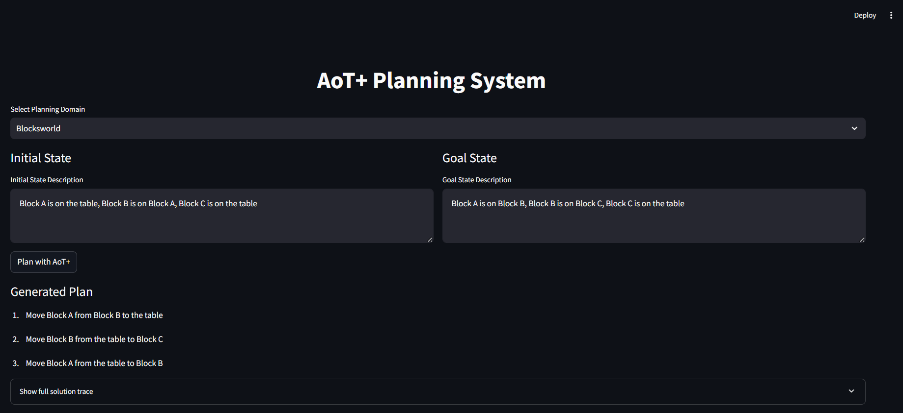

# AoT+ Planning System

[](https://www.python.org/downloads/)
[](https://streamlit.io)
[](https://github.com/llmsresearch/aot-plus)
[](https://github.com/llmsresearch/aot-plus)
[](https://opensource.org/licenses/MIT)

An implementation of the ""Algorithm of Thoughts Plus" approach for planning tasks using Large Language Models, based on the paper "LLMs CAN PLAN ONLY IF WE TELL THEM."

<p align="center">
  
</p>

## Paper Background

The AoT+ methodology addresses a critical challenge in AI: enabling large language models (LLMs) to effectively solve complex planning problems without requiring extensive fine-tuning or specialized architectures.

**Key innovations from the paper:**
- Demonstrates that well-crafted prompts alone can teach LLMs to plan effectively
- Shows that LLMs can learn to perform systematic planning, exploration, and backtracking through examples
- Achieves state-of-the-art planning results on complex domains without requiring architectural changes to the LLM

## Overview

AoT+ enhances LLMs' planning capabilities through two key techniques:

1. **Periodic State Memoization** - Helps LLMs keep track of the current state and avoid hallucination by periodically stating the world state
2. **Random Trajectory Augmentation** - Teaches LLMs to explore different paths and backtrack effectively by showing examples with both successful and unsuccessful exploration paths

## Supported Planning Domains

- **Blocksworld** - Classic planning domain involving stacking and unstacking blocks
- **Logistics** - More complex domain involving trucks, airplanes, packages, and locations across multiple cities

## Project Structure

```
.
├── demo.py                     # Command-line demonstration script
├── src/
│   ├── app.py                  # Streamlit web application
│   ├── aot_plus/               # Core AoT+ algorithm implementation
│   │   ├── core.py             # Main AoT+ class
│   │   └── prompt_builder.py   # AoT+ prompt construction
│   ├── domains/                # Planning domain implementations
│   │   ├── blocksworld.py      # Blocksworld domain
│   │   └── logistics.py        # Logistics domain
│   ├── models/                 # LLM client implementations
│   │   └── llm_client.py       # LLM client implementations (Azure, OpenAI, etc.)
│   └── utils/                  # Utility functions
│       └── config.py           # Configuration handling
├── assets/                     # Media assets
│   └── app_screenshot.png      # Application screenshot
└── requirements.txt            # Project dependencies
```

## Installation

1. Clone the repository:
   ```bash
   git clone https://github.com/llmsresearch/aot-plus.git
   cd aot-plus
   ```

2. Create a virtual environment (recommended):
   ```bash
   python -m venv .venv
   # On Windows:
   .venv\Scripts\activate
   # On Unix or MacOS:
   source .venv/bin/activate
   ```

3. Install dependencies:
   ```bash
   pip install -r requirements.txt
   ```

4. Set up LLM API credentials:
   
   Create a `.env` file in the project root with your API credentials:
   ```
   # Azure OpenAI
   AZURE_OPENAI_ENDPOINT="your-endpoint"
   AZURE_OPENAI_API_KEY="your-api-key"
   AZURE_OPENAI_DEPLOYMENT_NAME="your-deployment-name"
   AZURE_OPENAI_API_VERSION="2023-05-15"
   
   # Or for OpenAI:
   # OPENAI_API_KEY="your-api-key"
   # OPENAI_MODEL_NAME="gpt-4"
   
   # Or for Anthropic:
   # ANTHROPIC_API_KEY="your-api-key"
   # ANTHROPIC_MODEL_NAME="claude-3-opus-20240229"
   
   # Or for Google Gemini:
   # GOOGLE_API_KEY="your-api-key"
   # GOOGLE_MODEL_NAME="gemini-1.5-pro"
   ```

## Usage

### Command-line Demo

Run the demonstration script to see AoT+ in action with the Blocksworld and Logistics domains:

```bash
python demo.py
```

This will run a demonstration using the configured LLM provider for both domains.

### Interactive Web Application

Launch the Streamlit web application for an interactive experience:

```bash
streamlit run src/app.py
```

Or use the convenience script:

```bash
python run.py
```

The web application allows you to:
- Select between Blocksworld and Logistics domains
- View visual representations of the planning states
- Modify the initial and goal states
- Generate and visualize planning solutions

## Implementation Details

### AoT+ Methodology

The AoT+ approach enhances LLM planning capabilities through specialized prompts that:

1. **Include detailed domain descriptions** - Explain the rules, actions, and state representations for the planning domain
2. **Show examples with periodic state markers** - Demonstrate how to track the state after performing actions
3. **Include both optimal solutions and exploration paths** - Teach the model to explore different approaches and backtrack when needed
4. **Extract structured plans from model outputs** - Parse the generated plans into executable action sequences

## Contributing

We welcome contributions to the AoT+ project! Here's how you can help:

### Types of Contributions

- **Bug Reports**: Create an issue with a detailed description of the bug and steps to reproduce
- **Feature Requests**: Submit an issue describing the new feature you'd like to see
- **Code Contributions**: Submit a pull request with new features or bug fixes
- **Documentation**: Help improve or expand the documentation
- **Examples**: Contribute new example problems or domains

### Development Process

1. Fork the repository
2. Create a feature branch (`git checkout -b feature/amazing-feature`)
3. Make your changes
4. Commit your changes (`git commit -m 'Add some amazing feature'`)
5. Push to the branch (`git push origin feature/amazing-feature`)
6. Open a Pull Request

### Code Quality Guidelines

- Write clear, commented code
- Include tests for new features
- Follow existing code style and conventions
- Keep pull requests focused on a single change

## References

- Paper: "LLMs CAN PLAN ONLY IF WE TELL THEM" 
- Authors: Bilgehan Sel, Ruoxi Jia, Ming Jin
- Publication: arXiv preprint, 2025
- [Paper Link](https://arxiv.org/abs/2501.13545)


## Citation

If you use this code for your research, please cite the original paper:

```bibtex
@article{sel2025llms,
  title={LLMs Can Plan Only If We Tell Them},
  author={Sel, Bilgehan and Jia, Ruoxi and Jin, Ming},
  journal={arXiv preprint arXiv:2501.13545},
  year={2025}
}
```

## License

This project is licensed under the MIT License - see the [LICENSE](LICENSE) file for details.

---

**Note:** This implementation is for research and educational purposes. For commercial use, please ensure compliance with the terms of service of any LLM API providers you use.